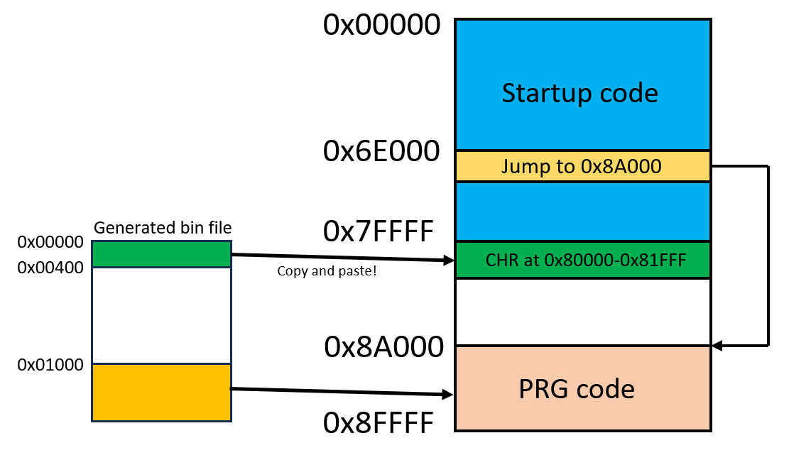
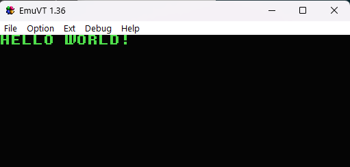
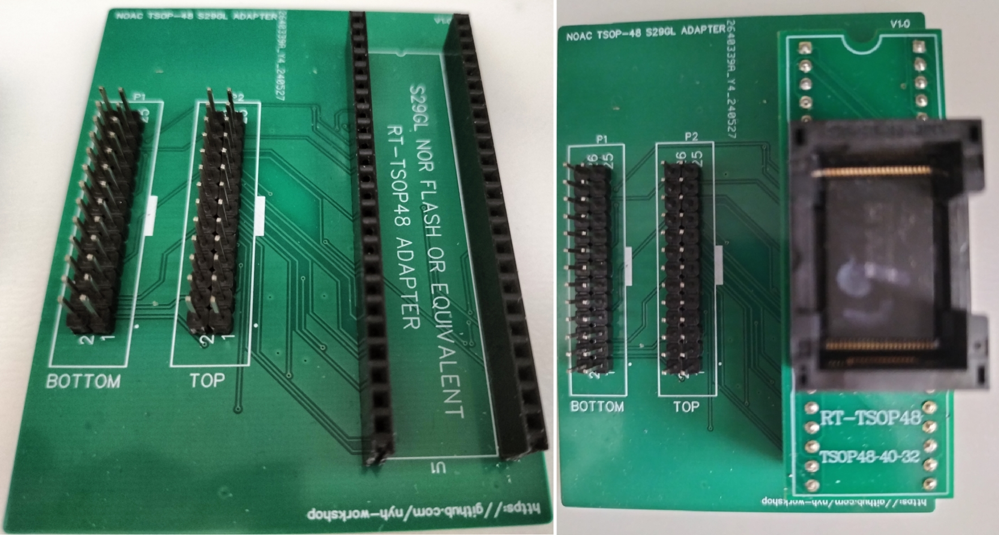
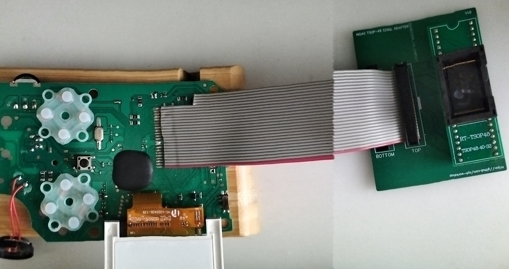
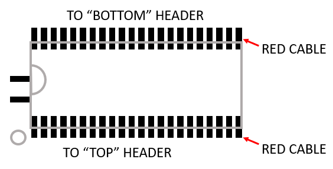
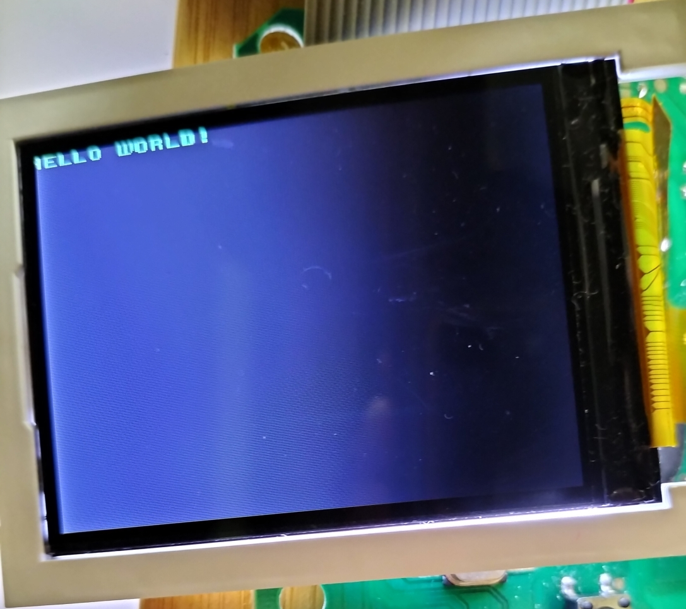

## Custom ROM

# Disclaimer: ***Do this at your own risk!*** Data loss, corruption or serious damage to the unit may occur! ***Proceed with caution!***

Before proceeding to create your custom ROM for the handheld - please read the articles:

- [How to dump the ROM](/HowToDumpTheROM.md)
- [ROM dump analysis](/ROM_dump_analysis.md)
- [Dumping the ROM](/DumpingTheROM.md)

Reworking the startup code to *only* include the startup code and without the menu code could be a very difficult process and sometimes very error-prone, especially on the newer handhelds.

In this one, you may need to **preserve the entire startup code** with minimal modifications. This is to have the TFT module running too!

First and foremost, you need the emulator **EmuVT 1.36** to verify if the custom ROM is working properly. Also a versatile hex editor such as HxD ready at your side too.

### 1. Important areas: the first 512K and 0x60000-0x7FFFF:

The physical address range 0x60000-0x7FFFF where the magic happens - most of the startup (and the menu code) are performed in this area, and that includes the test app code too. (Also, the list of bootleg and hacked ROMs inside that we don't want!)

---

An exception is, as mentioned in the [ROM dump analysis](/ROM_dump_analysis.md), newer units with more complex TFT initialization will have an area away from this address (0x2A000-0x2C000), and then jumps back to the 0x60000-0x7FFFF region.

---

There is an idea of relocating this back to the 0x60000-0x7FFFF, **but it is extremely troublesome**. So, the best idea is just to ***rip out the entire first 512K*** and then keep this separately as a 'startup template'.

### 2. Rip the entire first 512K out - and eliminate the menu code:

If you have used the [Ghidra](https://ghidra-sre.org/) and examined the flow in the regions 0x60000-0x7FFFF, there is a *possibility* that the menu is starting at **0x6E000**. If it is, just clear the **0x6E000-0x6EFFF** region out (with extreme prejudice!). Make it jump to your custom app instead! ***Save that binary file separately!***

### 3. Insert this code (and assemble it using a 6502 assembler such as [6502 virtual assembler](https://www.masswerk.at/6502/assembler.html)) into the place formerly the menu (0x6E000):

```
          LDA #$20
          STA $2018
          LDA #$00
          STA $201A
          LDA #$00
          STA $2016
          LDA #$02
          STA $2017
          LDY #$04
          STY $2012
          INY
          STY $2013
          INY
          STY $2014
          INY
          STY $2015
          ; Switch on the backlight:
          LDA #$1F
          STA $413F
          LDA #$0B
          STA $4138
          LDA #$0F
          STA $4139
          LDX #$30

cpyToRAM_Loop:
          LDA $E800,X
          STA $0400,X
          DEX
          BPL cpyToRAM_Loop
          JMP $0400

.org $E800
          LDA #$40
          STA $410A
          LDA #$03
          STA $410B
          LDA #$00
          STA $4100
          LDA #$04
          STA $4107
          LDA #$05
          STA $4108
          LDA #$00
          STA $4109
          JMP $A000
```

Summary: 
1.  This code prepares the OneBus mechanism to point the CHR code within 0x80000-0x81FFFF by filling in the registers from 0x2012-0x201A.

2.  At the *.org $E800* section the OneBus mechanism is needed to be run on RAM to jump into the desired PRG area within 0x88000-0x8FFFF by filling in the registers from 0x4100-0x410A.

3. The part of the program at (2) is copied into the RAM area 0x400 and jumps to there afterwards.

4. The program finally jumps to 0x8A000 successfully!

### 4. Build your own "Hello World" app using asm6f:

Get the [asm6f](https://github.com/freem/asm6f). Compile it using your own GCC and then put it in a folder.

By using your favourite hex editor, get the [chicago_oblique_basic.chr](/misc/chicago_oblique_basic.chr) here and then put it in that same folder.

Use the asm6f and try compiling it:

```
.incbin "chicago_oblique_basic.chr"

helloText EQU $A200

; ------------------
; main program here:
; ------------------
.org $A000
main_app:

    ; diasble interrupts on APU:
    lda #$40
    sta $4017
    lda #$00
    sta $4010

vblankwait1:
    ; First wait for vblank to make sure PPU is ready
    bit $2002
    bpl vblankwait1
    
enableBacklight:
    lda #$1f
    sta $413f
    lda #$0b
    sta $4138
    lda #$0f
    sta $4139
	
    ; clear RAM:
    tax
Init_ClearRAM:
    sta $000,x
    sta $100,x
    sta $200,x
    sta $300,x
    sta $400,x
    sta $500,x
    sta $600,x
    sta $700,x
    inx
    bne Init_ClearRAM
	
Init_PPU_chr:
    lda #$00
    sta $2012
    lda #$00
    sta $2013
    lda #$00
    sta $2014
    lda #$00
    sta $2015
	lda #$00
	sta $2016
	lda #$00
	sta $2017
	
    lda #$20
    sta $2018
    lda #%00000000
    sta $201A
    
    ; fill background with one value for 8 tiles:
    lda $2002	
    lda #$20
    sta $2006
    lda #$00
    sta $2006
	ldy #$00
FillAllBackground:
FillBackground:
   lda #$00
   sta $2007
   inx
   cpx #$ff
   bne FillBackground
   iny
   cpy #$04
   bne FillAllBackground
    
    ; Fill palette with 0x0f, 0x30, 0x30, 0x30:
    ; $3f00 = 0x0f
FillPalette:
    lda $2002
    lda #$3f
    sta $2006
    lda #$00
    sta $2006

	ldx #$00
FillPalleteLoop:
    lda #$0e
    sta $2007
    lda #$0e
    sta $2007
    lda #$2a
    sta $2007
    lda #$0e
    sta $2007
	inx
	cpx #$04
	bne FillPalleteLoop
	
PrintText:
	lda $2002
    lda #$20
    sta $2006
    lda #$00
    sta $2006
	ldx #$00
Print0:
    lda helloText, x
    cmp #$00
    beq PrintDone
    sbc #$20
    sta $2007
    inx
    jmp Print0
PrintDone:

Init_PPU:
    lda #%10000000
    sta $2000
    lda #%00001010
    sta $2001
    lda #$0
    sta $2005
    sta $2005

here:
    jmp here
; ------------------
NMI:
    rti
    
.org helloText
	.db "HELLO WORLD!", #$00
```

The binary file is generated after compilation. ***But that isn't done yet!*** You have to copy the first 0x400 bytes from the bin file and paste it at the green area (please look at the illustration), and the one from 0x1000 bytes onwards to the orange area:



Finally, run this at the emulator. If you encounter opcode bit swaps that is mentioned earlier in the ROM, have these bit swapped before running.

You should be seeing this:



### 5. Building the ROM adapter:

For this, a TSOP-48 or TSOP-56 flash is a good candidate for putting custom ROMs, since those Famiclones do run from these. You can build this adapter (PCB coming soon!):





If you have the board and you are building it, you need:

- 2.54mm male and female headers
- 26-pin IDC cable
- 26-pin IDC connector
- Crimper and a wire stripper
- RT-TSOP48 adapter

Here's a small guide:

1. Cut, strip and crimp the IDC cable. Basically, one of the IDC cable ***must be longer than the other by at least 3-4cm***! This is to have the longer cable to be able to reach the ROM board's header.

2. Connect and solder the shorter IDC cable to the "Bottom Header" as shown in the illustration. Do take note of the RED cable.

    Also, please take note of the flash breakout area - there will be circle at the end, or two more extra pads as a guide:



3. Then solder the longer IDC cable to the "Top Header".

4. Solder the male and female headers to the ROM adapter board according to the pictures, and then connect the cables to the board!

### 6: Flashing the ROM:

Once you have written the "Hello World" app, you can use a programmer such as T56 to copy the stuff into the flash chip. Of course, you also need to use the RT-TSOP48 adapter into the T56 too.

```
Attention: If you have those handhelds which have bit-swaps at the startup you need the original code fragment for the actual unit to run! 
```

When all is done, you should be seeing this:

