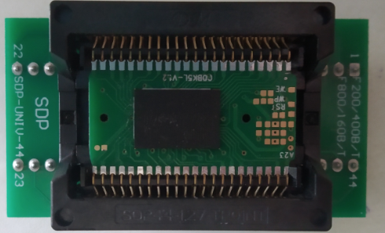
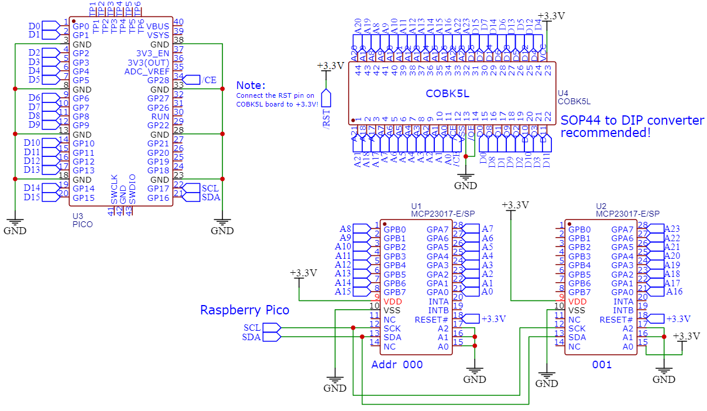

## Dumping the ROM - an attempt

# Notice: Any requests on getting the ROM images from me will *not* be entertained!

# Disclaimer: Do this at your own risk! Data loss, corruption or serious damage to the unit may occur! *Proceed with caution!*

Most of the Sup Game Box 400-in-1 contains a BGA breakout board with a BGA flash sitting on top of it. They are soldered *right* onto the unit's PCB and it presents **many challenges** to desolder and extract the ROM.

(If I'm not mistaken - some of these handhelds have a TSOP-56 flash instead of the breakout board. They are *much easier* to extract with conventional soldering tools)

For proper removal of the breakout board ["ChipQuik" removal alloy](https://www.chipquik.com/store/index.php?cPath=2200&osCsid=7mct4sj51vad1di6k4k8qs4n14) is used. ***Suggestions are welcome on other ways to extract the board without using the expensive ChipQuik!***

# If you are not interested in the earlier attempts, you can go to "How to Dump the ROM" link instead. :arrow_up:

___

## First attempt (October-November 2020):

For the first try in 2020, I managed to use a hot-air station. Bad news - the flash chip falls out and **the breakout board did NOT get desoldered**. Unfortunately, I broke the whole thing and it is beyond repair. I had salvaged the other parts such as the TFT, the rubber button pads, the miserable plastic casing and the broken board for other uses.

However, using the expensive ["ChipQuik" removal alloy](https://www.chipquik.com/store/index.php?cPath=2200&osCsid=7mct4sj51vad1di6k4k8qs4n14) I had safely extracted the breakout board without overheating the BGA chip, or ripping out the traces on the handheld's PCB.

Next - we **want** the stuff inside. This is another hurdle which I tried doing it on-and-off for a few years. Initially, there was a schematic of the breakout board floating around in the [EEVBlog forums thread](https://www.eevblog.com/forum/beginners/fun-project-hack-cheap-handheld-console-help-with-bga-nand-flash-chip-needed/):

The shape of this board resembled SOP-44 too - and there are many of these SOP-44 to DIP adapters around in the online stores. So I got one there and tried fitting the breakout board in...

... it *just* won't fit well. I had to file the corners off like this:

Finally it fits well:

From the provided pinout, I then connect the converter to the MCP23017 I/O expanders, Raspberry Pi, and wrote a Python script. This can be found in my [repository](https://github.com/nyh-workshop/arduino-teensy41-noac/tree/main/romdumper).

Since it runs on an I/O expander and the Raspberry Pi, dumping 16 megabytes would take almost a whole day! Unfortunately (which is already expected), trying to run this ROM into the EmuVT emulator just giving me a black screen.

## Second attempt (January 2023):

I didn't work on this for more than a year after that attempt. One fine day I found *another* schematic for the breakout - this time it is slightly different:

I took out that ROM dumper again, dusted it off, reworked some of the wirings and then dump again. This time, I got the full ROM and it works with the EmuVT:

In between, I was also experimenting on an idea to create a ROM emulator using the Raspberry Pico and the Teensy 4.1. You can refer to the page for more information.

## Third attempt (April 2024):

To improve the dumping speed, I had [reworked this dumper](https://github.com/nyh-workshop/arduino-teensy41-noac/tree/main/arduino-rp2040-romdumper) using Raspberry Pico with Arduino instead. It now takes **35 minutes** instead of many hours to dump:

For analysis, please read the [ROM dump analysis page](/ROM_dump_analysis.md).

___

### Extra Notes:

- Aleksandr Serdyukov [dumped its ROM using an Arduino Mega](https://github.com/Promolife/sup_console_programmator) and documented his process in his [Habr page](https://habr.com/ru/post/718366/) (articles written in Russian, use Google Translate!).

- Other attempts of dumping its ROM was also mentioned in the [4PDA forums](https://4pda.to/forum/index.php?showtopic=979648).

- The attempts were also journalled in my [Hackaday.io place](https://hackaday.io/project/175322-dissecting-a-hand-held-noac-console-sup-400-in-1).