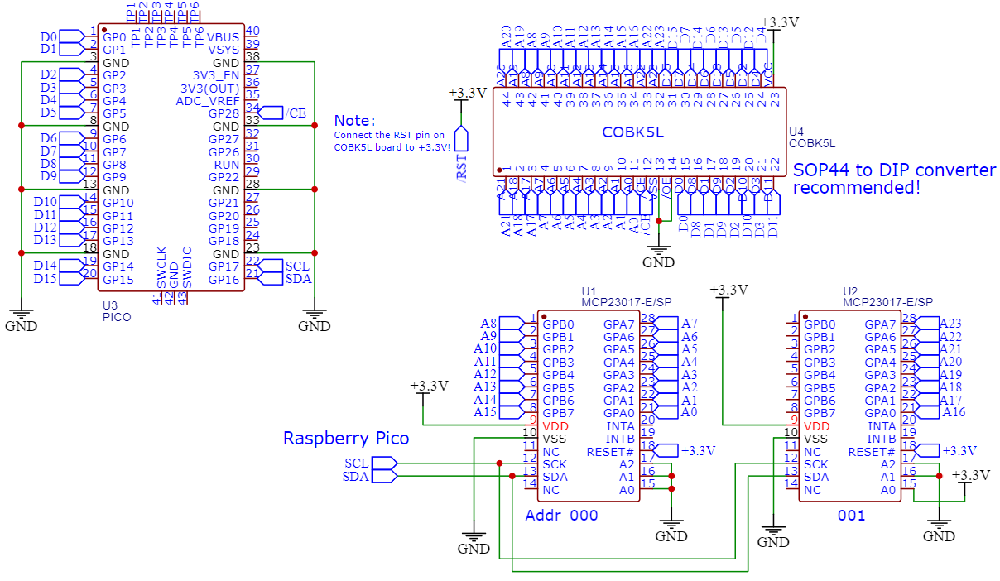
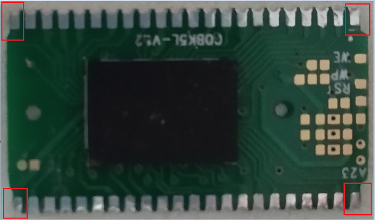
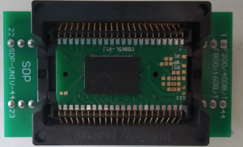

## How to dump the ROM?

---

# Notice: Any requests on getting the ROM images from me will *not* be entertained!

# Disclaimer: Do this at your own risk! Data loss, corruption or serious damage to the unit may occur! *Proceed with caution!*

---

## You need these:

- ChipQuik low melt desoldering alloy.
- Soldering station.
- A lot of flux. Also some isopropyl alcohol to clean the pads on the flash breakout area.
- SOP-44 converter board (SDP-UNIV-44).
- A small filing tool.
- Two breadboards, wires, Raspberry Pico RP2040 and 2x MCP23017 (DIP).
- Kapton tape.
- Tweezer.

## Directions:

1. Disconnect the battery from the unit and have it unplugged before you take it apart. 

2. Paste the kapton tape around the flash breakout board. You do not want excess ChipQuik to flow to the other components on the board and then risk desoldering them. 

3. Keep your soldering iron below 200 degrees Celcius. Put some ChipQuik alloy on *both sides* of the flash breakout board and heat it up.

4. Keep heating both sides and the alloy should be very runny. Have a tweezer ready and gently try to push the breakout board.

5. When the breakout board got detached, clean the vacated area with isopropyl alcohol and also get rid of the excess solder on the pads.

6. With your breadboards, wires, Raspberry Pico RP2040 and the I/O expanders, [build the circuit as shown in the other repository](https://github.com/nyh-workshop/arduino-teensy41-noac/tree/main/arduino-rp2040-romdumper).

    

7. The breakout board needed to be **filed at its four corners**. Do it gently, do not file off too much of the corners! Look at the red rectangles in the picture:

    

8. It should fit snugly like in this picture:

    

9. Put the converter and the breakout together into the dumper you just built.

10. Get that .ino into the Raspberry Pico, run the Python script provided and follow the instructions.

11. Once you dumped all of the binary, use an app called [YY-CHR](https://www.romhacking.net/utilities/119/) and HXD to examine the contents of the binary. In the YY-CHR, select the format "2BPP NES", and you should see **familiar cutouts and tiles** inside. If not, try reading the [ROM dump analysis](/ROM_dump_analysis.md) to approach this problem.