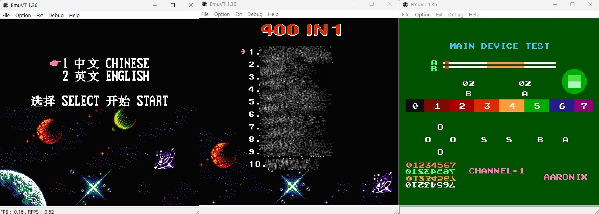
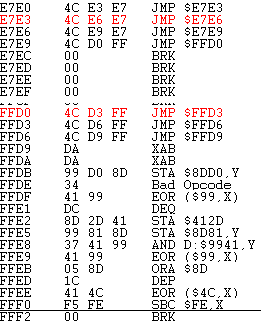
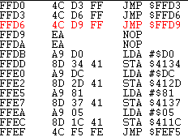
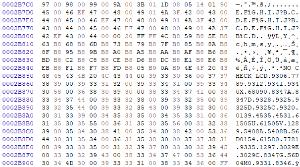

## ROM dump analysis

# Notice: Any requests on getting the ROM images from me will *not* be entertained!

Three of the ROM dumps from these handhelds that are bought between 2020 and 2023 are analyzed. Each of them seem to have some variations on its reset vectors and the startup code. However, the list of the games are mostly unchanged.

## Introduction:



On startup you will be presented with the language selection menu - Chinese or English. The background seemed to be from another game called "*Street Fighter 2010*".

In the Chinese menu, there is a different music being played, while in the English menu, there is no music at all.

If you hold the **A + B** and then press the **Reset button**, you will go into the "Main Device Test" where you can test the response of the buttons and the application is also testing different sound channels.

## Reset vector:

Since these consoles are suspected to be based on these "OneBus" architectures, the reset vector starts at **0x7FFFC**.

## General flow of the Startup code (0x60000-0x7FFFF):

<div class="mermaid">
graph TD;
    A[Get address from 0x7FFFC.] --> |Jumping to the desired address| B[Set Interrupt Disable, Clear Decimal.];
    B-->C[Increment into addresses 0x8000 and 0x8001 in a loop.];
    C-->D[Assign 0x07 and 0x33 to address 0x8000 and 0x8001.<br>Jumps to Main Startup, physical address 0x66700.];
    D-->E[Main Startup: Init some NES registers];
    E-->F[Fill 14 pre-set values into 0x4200-0x420E.];
    F-->G[Fill more pre-set values into 0x4220-0x4227];
    G-->H[Init TFT.];
    H-->I[Copies 0x30 bytes from 0x7FF70 to RAM area 0x400 and jump to there.];
    I-->J[At RAM area, bankswitching occurs by setting OneBus registers 0x4107-0x410B];
    J-->K["Scan controller (0x7aa40)"];
    K-->|A+B held| L["Go to Main Device Test (0x7AA60)"];
    K-->|no button presses| M["Go to Game Menu (0x6E000)"];
    M-->N["Enable Backlight by setting 0x0F to address 0x412C"]
</div>

### Note: This flowchart *does not cover* the test and the menu app! We are aiming to put our very own app inside and we need to preserve the startup routines. Without preserving it, it is *not possible to even get the TFT to start at all*! Not even the backlight!

### There are **variations** in how these things are initialized *even in the same identical* Sup Game Box 400-in-1. That is why you need to dump the ROM first and analyze whatever it is between 0x60000-0x7FFFF in order to preserve the TFT and device startup routines.


---


## Trouble with the bit-swaps:

On some of the handhelds, the **bits are swapped**. This is a nerve-racking affair because even after you have dumped it, it does not work in the emulator despite having the correct connections.

The ones I found are:

 - <u>Data bits swapped inside the dump</u>, for example bits 0-1 and bits 8-9. One tip is, view the dump using the [YY-CHR](https://www.romhacking.net/utilities/119/) app and examine if some of the tiles are distorted or not. If it is distorted (go browse the ROM around in the YY-CHR app and try looking at the alphanumeric characters for a start), you may need to examine the values in the binary files closely and see what bits have swapped.

 - <u>Bits at the </u>[opcodes are swapped](http://bootleg.games/BGC_Forum/index.php?topic=2412.0) <u>during startup</u>. This is seen in newer handheld that was bought in 2023. Here is an example when it is viewed in the EmuVT's trace debugger:



After some inspection, **bits 4-5 are swapped**. The emulator finally runs the dump if you swap these opcode's bits at that code fragment:



The game runs in the emulator - but you must ***leave the bits in the original state*** if you need to run it in the handheld!


---


## TFT initialization routines:

This is what makes the handheld console... a handheld console. If these routines are not present, the ***screen has no output*** and the only other display is on the AV-out jack. That's no longer handheld if you need to carry along a TV to play it!

I have examined three of these and each of them seemed to be an improvement over the other one. Let's call them type 1, 2 and 3:

### Type 1:
This one is straightforward. Put a command byte, calls write command, then put a data byte, calls write data:

```
writeCMD(0xfe);
writeCMD(0xef);
writeCMD(0x36);
writeCMD(0x28);
```

The functions that write the command and data to the TFT uses **$4230 and $4231**. At **$4233** again if it is a write command, $94 is written. If it is a write data, $D4 is written.

```
// ORG 0x66ABE
// Write CMD to TFT:
void fun_0x66ABE(uint8_t a0)
{
	// Possibly save a0 at 0x23 (RAM area), then copy to addr 0x4231.
	// Swap contents of RAM addr. 0x23, 0x24 and assign to 0x4230, 0x4231.
	// Then, 0x94 is assigned to addr. 0x4233:
	
	// At RAM area?
	*(0x23) = a0;
	a0 = *(0x24);
	*(0x4230) = a0;
	a0 = *(0x23);
	*(0x4231) = a0;
	
	*(0x4233) = 0x94;
}

// ORG 0x66AD0
// Write data to TFT:
void fun_0x66AD0(uint8_t a0)
{
	// Possibly save a0 at 0x25 (RAM area), then copy to addr 0x4231.
	// Swap contents of RAM addr. 0x25, 0x26 and assign to 0x4230, 0x4231.
	// Then, 0xd4 is assigned to addr. 0x4233:
	
	// At RAM area?
	*(0x25) = a0;
	a0 = *(0x26);
	*(0x4230) = a0;
	a0 = *(0x25);
	*(0x4231) = a0;
	
	*(0x4233) = 0xd4;
}

```

The TFT init values are not stored in an array.

### Type 2:
Instead of calling it one-by-one in Type 1, the TFT init values are stored in the array and a small loop is run to do the initialization:
```
do {
    DAT_0130 = LCD_settings[bVar2];
    FUN_a8c7();
    while( true ) {
      bVar3 = bVar2 + 1;
      cVar1 = LCD_settings[bVar3];
      if (cVar1 == -2) break;
      if (cVar1 == -1) {
        FUN_a8b5(2);
        FUN_a8af();
        FUN_a8b5(1);
        return;
      }
      DAT_0132 = cVar1;
      FUN_a8d9();
      bVar2 = bVar3;
    }
    bVar2 = bVar2 + 2;
  } while( true );

// LCD settings:
uint8_t LCD_settings[] = {
    0x11, 0xFE, 0xFE, 0xFE, 0xEF, 0xFE, 0x36, 0x28, 0xFE, 0x3A, 0x05, 0xFE,
    0xA4, 0x44, 0x44, 0xFE, 0xA5, 0x42, 0x42, 0xFE, 0xAA, 0x88, 0x88, 0xFE,
    0xE8, 0x11, 0x0B, 0xFE, 0xE3, 0x01, 0x10, 0xFE, 0xFF, 0x61, 0xFE, 0xAC,
    0x00, 0xFE, 0xAE, 0x2B, 0xFE, 0xAD, 0x33, 0xFE, 0xAF, 0x55, 0xFE, 0xA6,
    0x2A, 0x2A, 0xFE, 0xA7, 0x2B, 0x2B, 0xFE, 0xA8, 0x18, 0x18, 0xFE, 0xA9,
    0x2A, 0x2A, 0xFE, 0x2A, 0x00, 0x00, 0x01, 0x3F, 0xFE, 0x2B, 0x00, 0x00,
    0x00, 0xEF, 0xFE, 0x2C, 0xFE, 0xF0, 0x02, 0x02, 0x00, 0x08, 0x0C, 0x10,
    0xFE, 0xF1, 0x01, 0x00, 0x00, 0x14, 0x1D, 0x0E, 0xFE, 0xF2, 0x10, 0x09,
    0x37, 0x04, 0x04, 0x48, 0xFE, 0xF3, 0x10, 0x0B, 0x3F, 0x05, 0x05, 0x4E,
    0xFE, 0xF4, 0x0D, 0x19, 0x17, 0x1D, 0x1E, 0x0F, 0xFE, 0xF5, 0x06, 0x12,
    0x13, 0x1A, 0x1B, 0x0F, 0xFE, 0x29, 0xFE, 0x2C}
```

Similar to the Type 1, it uses the same registers to write to TFT.

([Ghidra](https://ghidra-sre.org/) is used to decompile this to C code!)

### Type 3:
This one is from the **newer handheld in 2023**. The code is ***extremely convoluted even when it is decompiled into C***! Unfortunately, it is still not known how it writes to the TFT - there are multiple registers that are involved!

At the startup, the app has to jump to *as far as address 0x2A000* where all the TFT routines are.

Basically, instead of **putting one kind of TFT**, the developer had put many other TFT models inside. I suspect that there is one variable for the TFT model that is saved into the flash and have that function select it and init the TFT accordingly. How convenient!



---

## Backlight:

If you have already read about the "*TFT Initialization Routines*" earlier, these TFT are equipped with a backlight. The strange part is, these backlight registers are different in each of these builds. For the [GC9306 TFTs](documents/GC9306_DS_V1.01.pdf) inside the handhelds, nothing happens when I tried to write anything to its backlight (TFT) registers. The backlight might be connected to the handheld's system.

I also noticed that as for now I've seen that ***only after the TFT initialization*** and ***when it is entering the menu***, the backlight switches on.

### Type 1 and 2:

The backlight is at $412C - putting a 0 there switches it off, and an 0xF switches it on:

```
; switches off backlight!
lda #$00
sta $412C

; switches on backlight!
lda #$0F
sta $412C
```

### Type 3:

Unfortunately, I did not get how it switches off the backlight. However, for switching it on, at the same menu start, it accesses and writes to this registers, which I suspect one of them are something to do with the backlight:

```
; Switches on backlight!
lda #$1f
sta $413f
lda #$0b
sta $4138
lda #$0f
sta $4139
```
