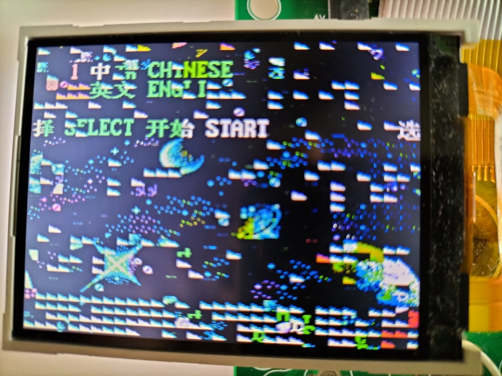
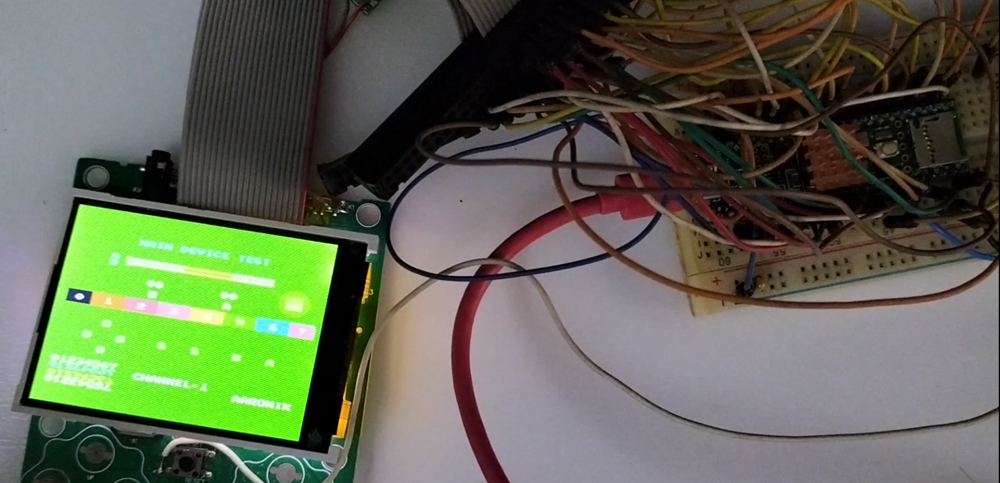
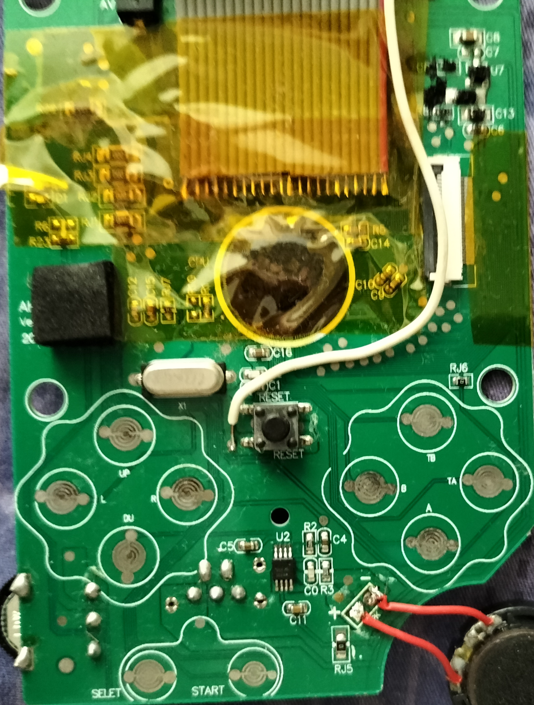
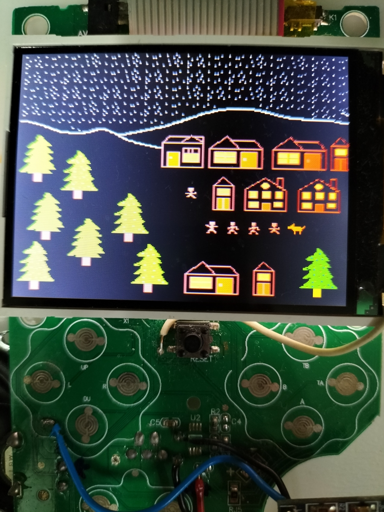

## ROM Emulator Development

To improve the experience in the custom ROM development, emulating the ROM is one of the ways.

At least we do not have to pull the ROM out of the socket repeatedly or desolder it to reprogram it. The binary can be **simply** uploaded into the emulator and the results can be seen immediately.

However, this is never simple:

- Not many microcontrollers pins are capable of keeping up with access times are extremely tight (70-100ns). Teensy 4.1 is one of those, however you may need to crank it up to 912MHz and require cooling!

- Raspberry Pico (RP2040) has a PIO (Programmable I/O) which could handle this tight access times like these, however it could not have enough pins to do so.

- FPGA is another alternative, but very steep learning curve.

### Basic block diagram 
<div class="mermaid">
graph LR;
    A["PC"] -->|serial port| B["ROM Emulator"] -->|connects to the flash pins|C["Sup 400-in-1"];
</div>

## First attempt - RP2040:

These things have "Programmable I/O" and it could drive these pins better and faster. However, the original Raspberry Pico do not have enough pins and I could only connect 16 data pins, and another 5 or 6 address pins. Not enough address pins - I have to make do with only putting in the first 32 or 64 bytes. As usual, inspired from the [github page](https://github.com/gfoot/picoprom/tree/main), the binary is transferred through the Ymodem.

I managed to get the thing to ***sound a note*** by writing in its APU registers in the binary and that's much about it. At other times, it has very erratic behaviour and very unpredictable.

Here's the PIO code:

```
.program getDataFromAddr

.define public ADDR_LENGTH 5
.define public DATA_LENGTH 16

.wrap_target
    mov osr, null
    out pindirs, 21
    wait 0 gpio 27
    in pins, 21
    mov osr, ~null
    out pindirs, DATA_LENGTH
    irq wait 0
    out pins, DATA_LENGTH 
.wrap

.program disableDataPins

.define public ADDR_LENGTH 5
.define public DATA_LENGTH 16

.wrap_target
    wait 1 gpio 27
    in pins, DATA_LENGTH
.wrap

```

If the RP2040 has more pins and it is faster, there could be more chances it can become an ROM emulator.

## Second attempt - Teensy 4.1:

Here is the [repository](https://github.com/nyh-workshop/arduino-teensy41-noac).

This one works faster and better, of course! I managed to connect the first 16 address pins and the data pins to the Teensy 4.1. Similar to the [first attempt](#first-attempt---rp2040), this has more pins and more RAM for us to work on!

So I connected this Teensy 4.1 to a breadboard, and I encountered one issue when I ripped the first 128K - the game runs but the display is extremely garbled at 600MHz:



Slowly and slowly I pushed the speed up to 916MHz and tied the address lines with the interrupt-on-change. ***This needed a small fan and a heatsink!*** This finally worked well when all the visual artifacts disappeared entirely:





Well, I tried experimenting some more too:



Drawn with [NES Assets Workshop](https://nesrocks.itch.io/naw).


---


Hmm... what about the ROM that I got from the 2023 version?

... it doesn't work anymore! Worse of all the Teensy 4.1 behaved extremely erratic at such higher speed - it kept disconnecting and restarting. 

I have to abandon this one - but at least I also have the [ROM adaptors](/Custom_ROM.md) that I'm going to use after testing with the ROM emulator. All is not lost as I can still test the custom ROMs with the ROM adaptors, albeit slower.