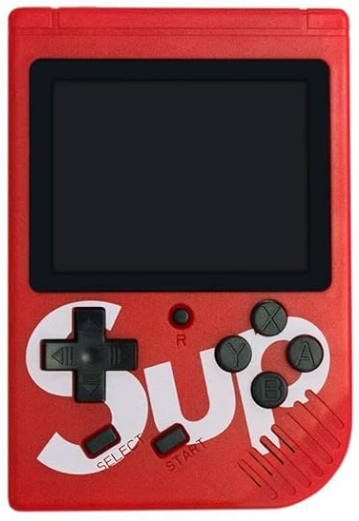
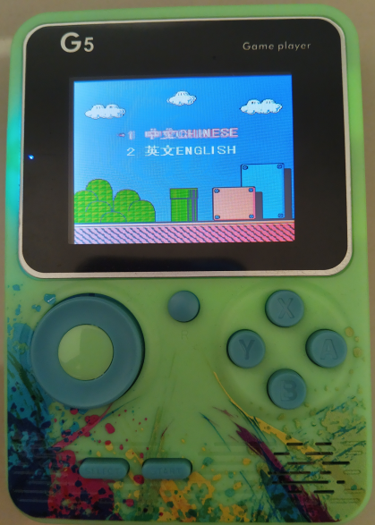
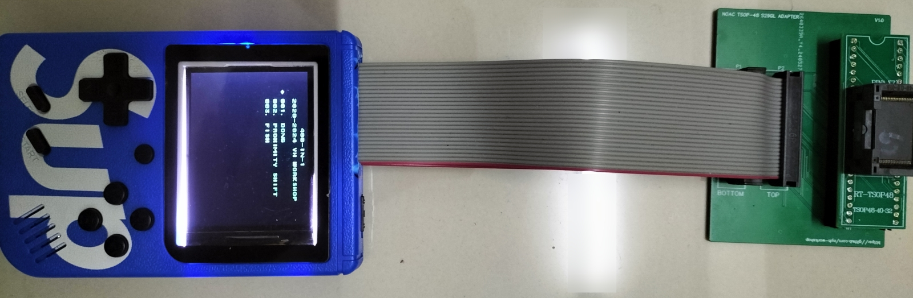
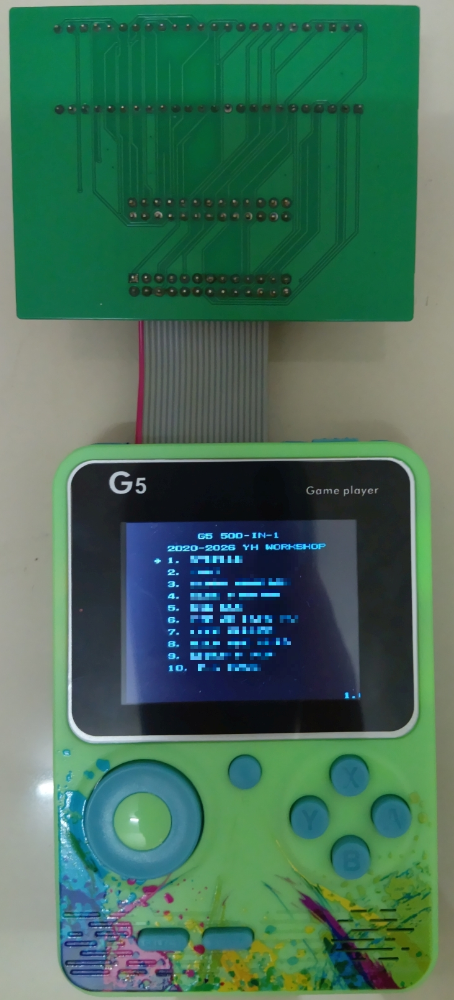
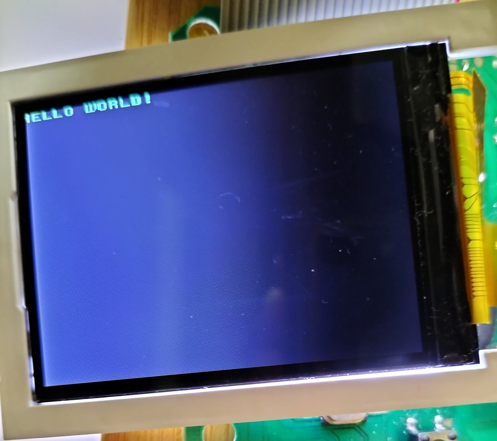
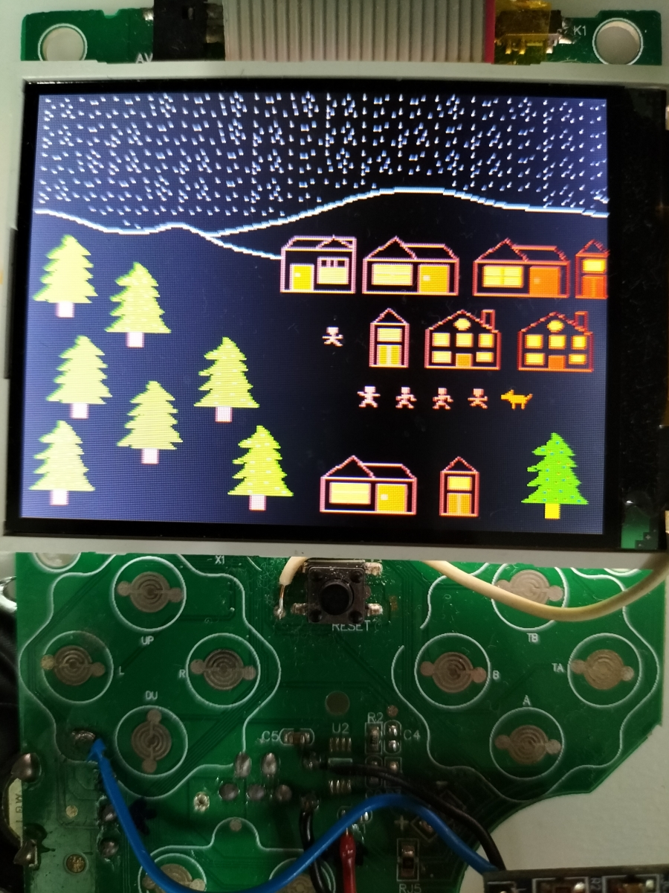

## Alright, what is a "Sup *Game Box* 400-in-1" (and also G5)?
Here it is:

Image from [one of the marketplaces](https://www.desertcart.com.my/products/147295746-sup-400-in-1-games-retro-game-box-console-handheld-game-pad-assorted-color).

It is a Famiclone handheld with the big "Sup" that are being sold in many local online stores. Sometimes, you will also bump into the G5.

They are loaded with about 400 bootleg Famicom games and also ROM hacks. The G5 ones have 500 inside and works almost identical to the "Sup" but the menu is different.

Also, they do appear in some different colors - red, blue, black, white and yellow. For the G5, there are a few light shades of green, blue, pink or possibly grey.

I do not know when these things *actually* exist, I have been seeing a lot of these since late 2019 onwards, especially for the Sup Game Box 400-in-1.

More information on how to dump its ROM, analysis and references are on the header. :arrow_up:

## Running a Custom ROM:

##### Running a custom menu. Fitted with the original plastic casing. A part of the plastic has been broken and filed off near the unit's power switch to accomodate the IDC cables.

##### Running with actual flash ROM inside.

##### Running with Teensy 4.1 ROM emulator. Artwork created using [NES Assets Workshop](https://nesrocks.itch.io/naw)

## Acknowledgements:

- The [NESDev](https://forums.nesdev.org/) members for providing many info about NES programming.

- The [BGC Forums](http://bootleg.games/BGC_Forum/index.php) members for providing useful info on the OneBus systems.

- Fun homebrew games by [MobyDeee (DONG, 2023)](https://mobydeee.itch.io/dong-nes), [Fiskbit (Proximity Shift, 2023)](https://fiskbit.itch.io/proximity-shift) and [Voxel (Fish, 2023)](https://voxel.itch.io/nes-fish). These are used to test the handheld during the research.