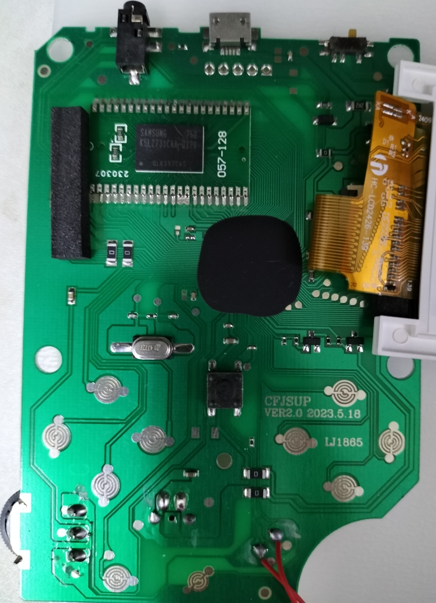
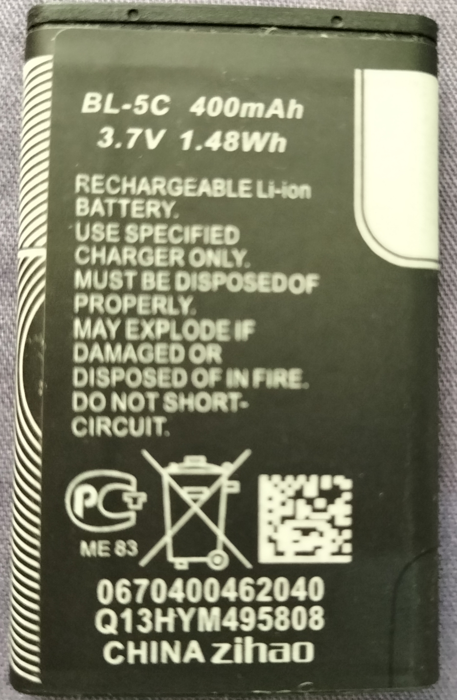

## What is it inside??

I have torn down these things and I found:

- **BL-5C battery**. Best to take it out when not playing it! And best don't leave it alone when charging it!

- **TFT screen module**. Sticking this thing into a [FPC converter, Arduino and the Arduino sketch](https://github.com/prenticedavid/MCUFRIEND_kbv/blob/master/examples/LCD_ID_readreg/LCD_ID_readreg.ino) it shows that it is a [GC9306](documents/GC9306_DS_V1.01.pdf). This is found on the handhelds that are bought in 2020. After that year, by using the same technique, it does not report this model number anymore. However,  swapping the screen on another Sup 400-in-1 that are bought in a different year *normally* works too. (Note: Your mileage may vary on this!!)

- **BGA Flash Carrier**. The NOR flash are usually [Samsung K5L2731CAM-D770](documents/K5L2731CAM-D770.pdf), "Unknown Model" V00670002ADGB and [ST M36L0T705](documents/M36L0R7050T0.PDF). They are 16 megabytes of size. These sit on top of a breakout board that is then soldered onto the unit's PCB. Extracting this thing out is a painful and very error-prone process. I recommend a ChipQuik to do so for ROM dumping. ***Suggestions are welcome to extract this with a lower cost!*** Please refer to the "How to Dump its ROM" for more information.

- **Black blob**. Well, we are stuck here of course, unless if someone curious could expose the die and have it examined in a microscope. Exploring the forums such as [BGC Forums](http://bootleg.games/BGC_Forum/index.php) and [NesDev Forums](https://forums.nesdev.org/) it is highly suspected that this is a Nintendo-on-a-Chip (NOAC) with OneBus to accomodate 16-bit data parallel flash.